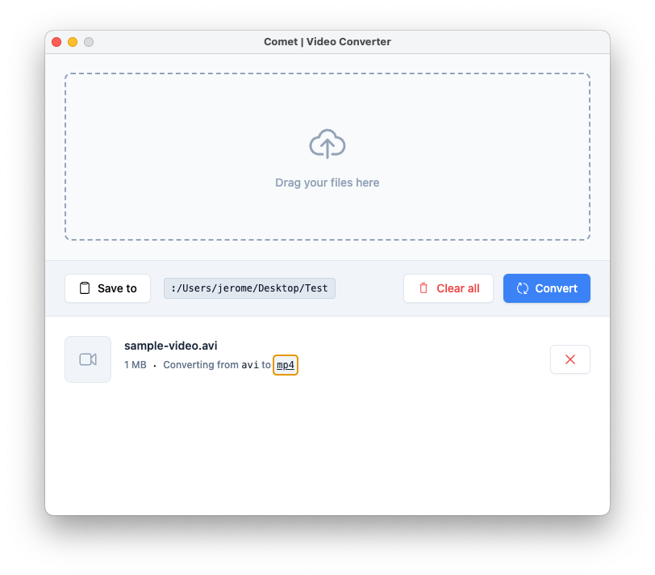
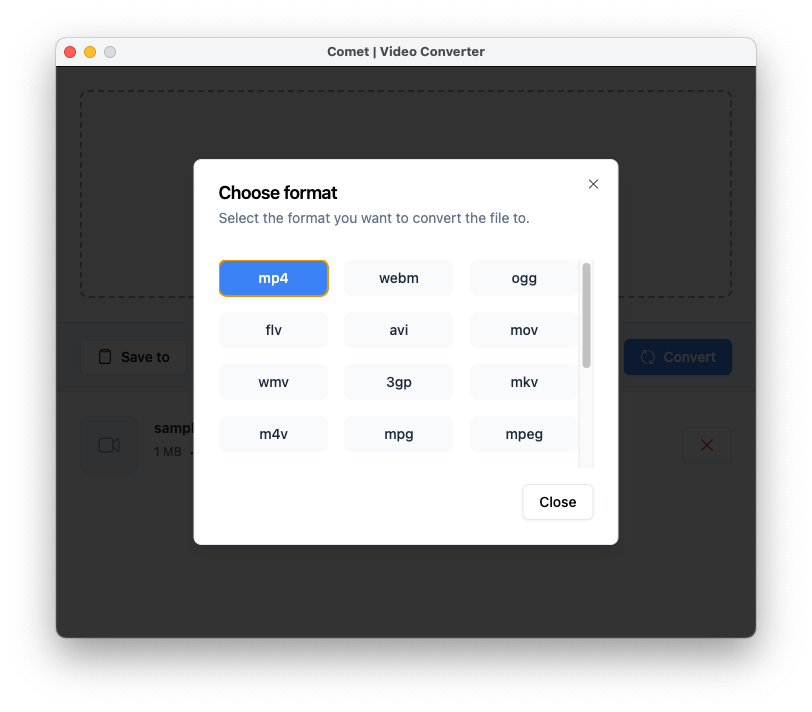
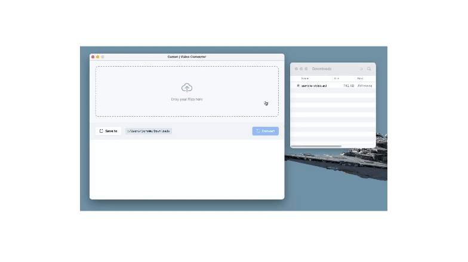

<p align="center"><a href="https://thavarshan.com" target="_blank"></a></p>

## About Comet

**Comet** is a cross-platform video converter application designed to make video conversion as easy and accessible as possible. Leveraging the power of [FFmpeg](https://ffmpeg.org/), Comet allows users to convert video files into a variety of formats, all within a simple, intuitive interface.





## 🚀 Project Overview

Comet's goal is to provide a free, user-friendly, and visually appealing application for converting video files. Whether you need to convert a single video or multiple files at once, Comet is here to help.

### Key Features (Planned and Implemented)

- **Cross-Platform Compatibility:** Runs on macOS, Windows, and Linux.
- **Multiple Video Formats:** Supports conversion to a wide range of video formats including MP4, MKV, AVI, MOV, and more.
- **Bulk File Conversion:** Easily upload and convert multiple files in one go.
- **User-Friendly Interface:** A clean and intuitive UI that simplifies the conversion process.
- **Real-Time Conversion Feedback:** Conversion progress is tracked and displayed to the user, with real-time updates and error handling.
- **Fast Conversion:** Powered by FFmpeg, known for its speed and efficiency in video processing.

### Current Status

The project has made significant progress, with the basic UI now fully implemented, including bulk file uploads and conversion status tracking. The core video conversion functionality using FFmpeg has been successfully integrated, with ongoing improvements to the user experience, such as real-time feedback during the conversion process.

## 🛠️ Technologies Used

- **Electron:** For building the cross-platform desktop application.
- **Vue.js (with Composition API and TypeScript):** For the frontend UI.
- **FFmpeg:** The core engine for video format conversion.
- **Node.js:** Backend services and script automation.
- **Vite:** For fast and modern build tooling.
- **Tailwind CSS:** For styling and responsive design.

## 📂 Project Structure

```bash
comet/
│
├── .vite/                           # Vite configuration directory
├── .vscode/                         # VSCode settings directory
├── bin/                             # Custom FFmpeg binaries
│   └── ffmpeg/                      # FFmpeg binaries for different platforms
│       ├── linux/
│       ├── mac/
│       └── win/
├── src/
│   ├── assets/
│   │   ├── css/
│   │   │   └── index.css            # Global CSS file
│   │   └── images/
│   │       └── screenshot.png       # UI screenshot for README
│   ├── components/
│   │   ├── Dropfile.vue             # Dropfile component for file uploads
│   │   └── SaveDirectory.vue        # Component to handle save directory selection
│   ├── global.d.ts                  # Global TypeScript declarations
│   ├── main.ts                      # Main process file
│   ├── preload.ts                   # Preload script
│   ├── renderer.ts                  # Renderer process entry point
│   └── App.vue                      # Main Vue component
│
├── .editorconfig                    # Editor configuration
├── .eslintrc.json                   # ESLint configuration
├── .gitignore                       # Git ignore file
├── LICENSE                          # License file
├── index.html                       # Entry HTML file
├── postcss.config.js                # PostCSS configuration
├── tailwind.config.js               # Tailwind CSS configuration
├── package-lock.json                # Lockfile for npm dependencies
├── package.json                     # Node.js project configuration
├── tsconfig.json                    # TypeScript configuration
├── README.md                        # Project README file
├── forge.config.ts                  # Electron Forge configuration
├── vite.base.config.ts              # Vite base configuration
├── vite.main.config.ts              # Vite main process configuration
├── vite.preload.config.ts           # Vite preload script configuration
└── vite.renderer.config.ts          # Vite renderer process configuration
```

## 🚧 How to Contribute

We welcome contributions and collaboration! Whether you're a seasoned developer or just starting out, there's a place for you in our project. Here's how you can help:

1. **Fork the Repository:** Start by forking this repository to your GitHub account.
2. **Clone the Repo:** Clone the forked repo to your local machine using `git clone`.
3. **Set Up the Environment:** Follow the steps below to get the project running on your local machine.
4. **Create a Branch:** Create a new branch for the feature or fix you plan to work on.
5. **Submit a Pull Request:** Once your changes are ready, submit a pull request to the `main` branch of this repository.
6. **Star the Repository:** If you like this project, please give it a star on GitHub. It helps us gain visibility and grow our community!

### Getting Started

To get started with development:

1. **Clone the repository:**

   ```bash
   git clone https://github.com/Thavarshan/comet.git
   cd comet
   ```

2. **Install dependencies:**

   ```bash
   npm install
   ```

3. **Run the application in development mode:**

   ```bash
   npm run start
   ```

4. **Build the application for production:**

   ```bash
   npm run make
   ```

5. **Test your changes:**
   - Ensure your changes do not break existing functionality.
   - Write unit tests if possible and applicable.

## 📝 Roadmap

- **Phase 1:** Basic UI Implementation (Completed)
  - File upload functionality.
  - Simple file selection and list management.

- **Phase 2:** FFmpeg Integration (In Progress)
  - Implement core conversion functionality.
  - Support for multiple video formats.
  - Real-time conversion feedback.

- **Phase 3:** UI Enhancements and Customization Options
  - Output format selection and settings.
  - Batch processing capabilities.

- **Phase 4:** Cross-Platform Testing and Release
  - Test and refine the app on macOS, Windows, and Linux.
  - Prepare for the first public release.

## 🧑‍💻 Contributors

- **Jerome Thayananthajothy** - Project Lead & Developer
- [**Contributors List**](https://github.com/Thavarshan/comet/graphs/contributors) - A big thank you to all the amazing contributors!

## 📄 License

This project is licensed under the MIT License - see the [LICENSE](LICENSE) file for details.

## 🌟 Acknowledgements

- [FFmpeg](https://ffmpeg.org/) - The powerful multimedia framework that makes this project possible.
- The Electron and Vue.js communities for their fantastic tools and support.

## 🙌 Support

If you find this project helpful or interesting, please consider giving it a ⭐ on GitHub. Your support and feedback are greatly appreciated!

---

Thank you for visiting our project! We’re excited to bring this tool to life and make video conversion easy and accessible for everyone. Any help, be it in coding, testing, or simply providing feedback, is invaluable. Let's create something great together!

---
