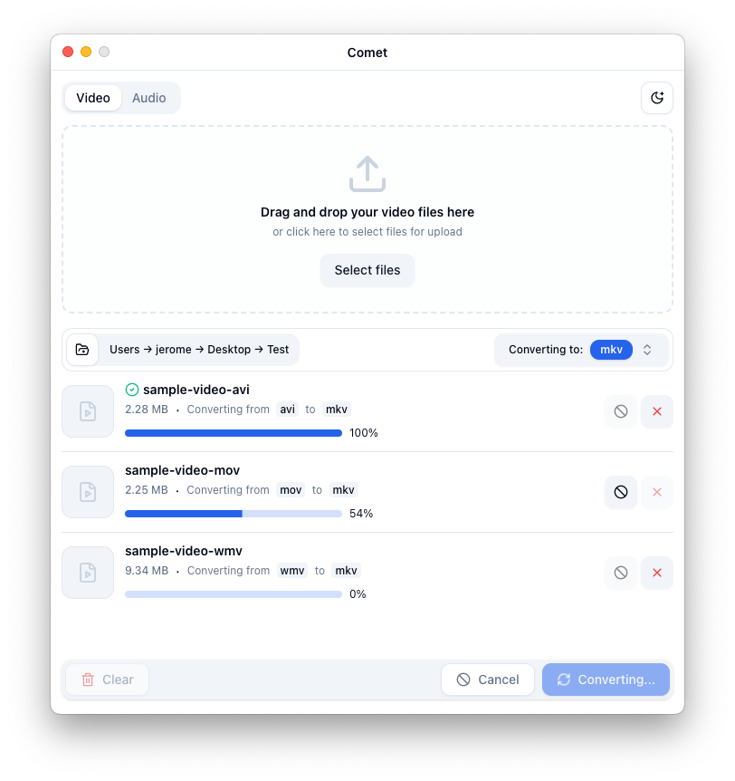
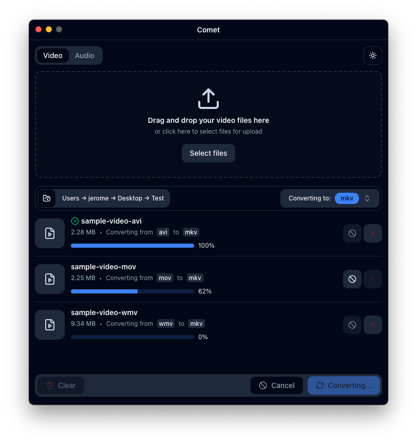
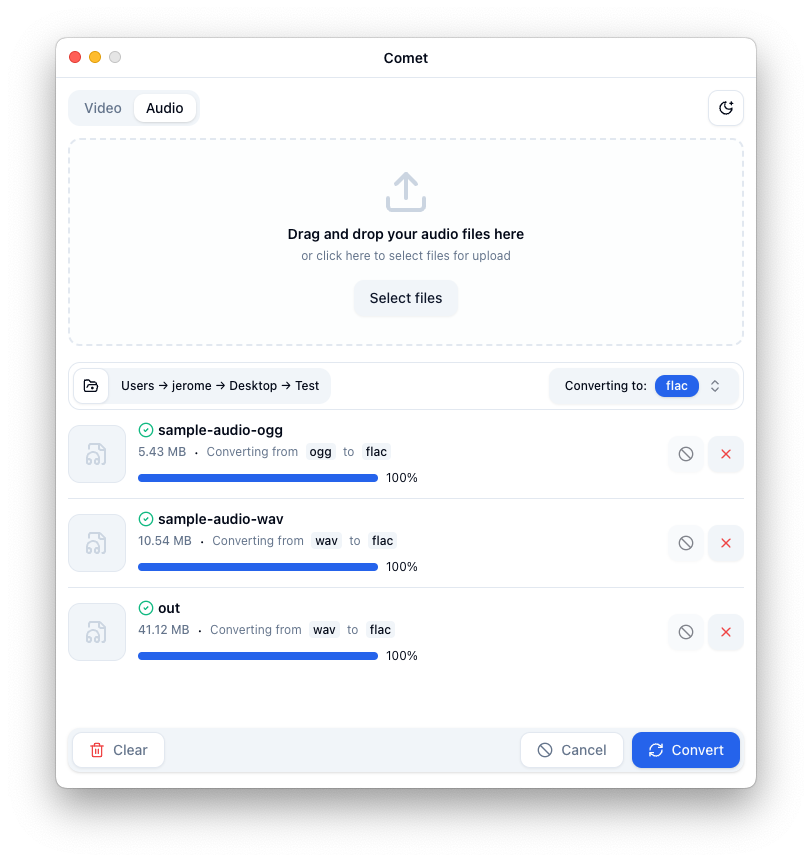
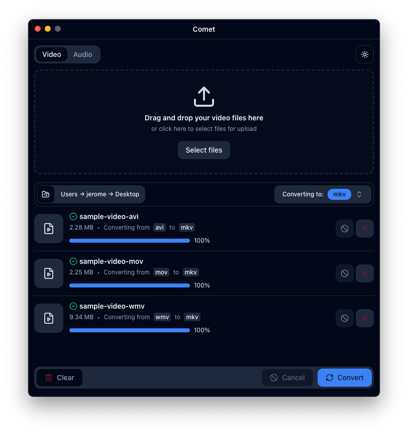

<p align="center"><a href="https://comet.thavarshan.com" target="_blank"></a></p>

<p align="center">
<a href="https://github.com/stellar-comet/comet/actions"></a>
<a href="https://github.com/stellar-comet/comet/actions"></a>
<a href="https://github.com/stellar-comet/comet/actions"></a>
<a href="https://packagist.org/packages/jerome/filterable"></a>
</p>

> [!WARNING]
> We don't have an Apple Developer account yet, and the application is not code-signed for both Mac and Windows. Therefore, the applications will show a warning popup on the first start. On Mac, click **Okay**, then go to **Settings / Privacy & Security** and scroll down until you see a button **Open anyway**. You'll have to do this once. On Windows, you may see a warning message indicating that the app is from an unknown publisher. Click **More info** and then **Run anyway** to proceed.

## About Comet

**Comet** is a cross-platform video and audio converter application designed to make media conversion as easy and accessible as possible. Leveraging the power of [FFmpeg](https://ffmpeg.org/), Comet allows users to convert video and audio files into a variety of formats, all within a simple, intuitive interface.






## Project Overview

Comet's goal is to provide a free, user-friendly, and visually appealing application for converting video and audio files. Whether you need to convert a single file or multiple files at once, Comet is here to help.

### Key Features

- **Cross-Platform Compatibility:** Runs on macOS, Windows, and Linux.
- **Video and Audio Conversion:** Supports conversion to a wide range of video formats (MP4, MKV, AVI, MOV, etc.) and audio formats (MP3, WAV, AAC, FLAC, etc.).
- **Bulk File Conversion:** Easily upload and convert multiple files in one go.
- **User-Friendly Interface:** A clean and intuitive UI that simplifies the conversion process.
- **Real-Time Conversion Feedback:** Conversion progress is tracked and displayed to the user, with real-time updates and error handling.
- **Fast Conversion:** Powered by FFmpeg, known for its speed and efficiency in media processing.
- **Dark Mode:** Provides a dark theme for users who prefer a more comfortable visual experience.
- **Multi-Language Support:** Available in multiple languages for a global audience.

### Current Status

The project has made significant progress:

- **Basic UI and Core Functionality:** The user interface is fully implemented, supporting bulk file uploads, conversion status tracking, and real-time feedback.
- **FFmpeg Integration:** The core video and audio conversion functionality is complete, making the app fully functional.
- **Cross-Platform Distributables:** Distributables for macOS, Windows, and Linux have been successfully created. However, due to the high cost of an Apple Developer membership, the app is currently not code-signed or notarized for macOS, which may present challenges when running it on Mac devices.

## Technologies Used

- **Electron:** For building the cross-platform desktop application.
- **Vue.js (with Composition API and TypeScript):** For the frontend UI.
- **FFmpeg:** The core engine for video and audio format conversion.
- **Node.js:** Backend services and script automation.
- **Vite:** For fast and modern build tooling.
- **Tailwind CSS:** For styling and responsive design.
- **Jest:** For unit testing.
- **GitHub Actions:** For CI/CD and release automation.

### Getting Started

To get started with development:

1. **Clone the repository:**

   ```bash
   git clone https://github.com/stellar-comet/comet.git
   cd comet
   ```

2. **Install dependencies:**

   ```bash
   npm install
   ```

3. **Run the application in development mode:**

   ```bash
   npm run start
   ```

4. **Build the application for production:**

   ```bash
   npm run make
   ```

5. **Test your changes:**
   - Ensure your changes do not break existing functionality.
   - Write unit tests if possible and applicable.

## Roadmap

- **Phase 1:** Basic UI Implementation (Completed)
  - File upload functionality.
  - Simple file selection and list management.

- **Phase 2:** FFmpeg Integration (Completed)
  - Implement core conversion functionality.
  - Support for multiple video formats.
  - Real-time conversion feedback.

- **Phase 3:** UI Enhancements and Customization Options (Completed)
  - Output format selection and settings.
  - Batch processing capabilities.

- **Phase 4:** Cross-Platform Testing and Release (In Progress)
  - Test and refine the app on macOS, Windows, and Linux.
  - **Package the app for distribution** on various platforms.
  - **Overcome code signing challenges**, particularly on macOS due to the cost of an Apple Developer membership.
  - Prepare for the first public release.

## Support

If you find this project helpful or interesting, please consider giving it a ⭐. Your support and feedback are greatly appreciated!

## Contributors

- **Jerome Thayananthajothy** - Project Lead & Developer
- [**Contributors List**](https://github.com/stellar-comet/comet/graphs/contributors) - A big thank you to all the amazing contributors!

## How to Contribute

We welcome contributions and collaboration! Whether you're a seasoned developer or just starting out, there's a place for you in our project. Here's how you can help:

1. **Fork the Repository:** Start by forking this repository to your GitHub account.
2. **Clone the Repo:** Clone the forked repo to your local machine using `git clone`.
3. **Set Up the Environment:** Follow the steps below to get the project running on your local machine.
4. **Create a Branch:** Create a new branch for the feature or fix you plan to work on.
5. **Submit a Pull Request:** Once your changes are ready, submit a pull request to the `main` branch of this repository.
6. **Star the Repository:** If you like this project, please give it a star on GitHub. It helps us gain visibility and grow our community!

## License

This project is licensed under the MIT License - see the [LICENSE](LICENSE) file for details.

## Acknowledgements

- [FFmpeg](https://ffmpeg.org/) - The powerful multimedia framework that makes this project possible.
- The Electron and Vue.js communities for their fantastic tools and support.

---

Thank you for visiting our project! We’re excited to bring this tool to life and make media conversion easy and accessible for everyone. Any help, be it in coding, testing, or simply providing feedback, is invaluable. Let's create something great together!
